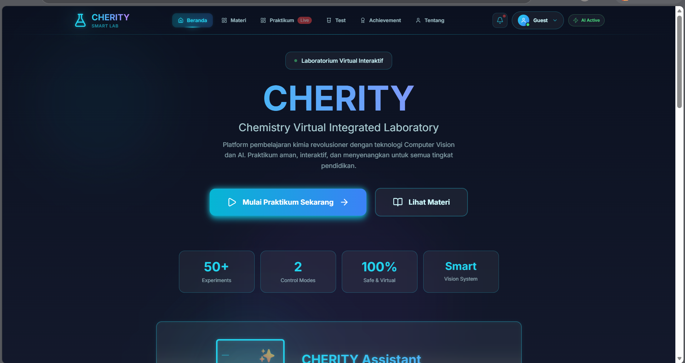

# CHERITY (Chemistry Virtual Integrated Laboratory) 🧪✨

> **Transformasi Laboratorium Kimia Digital yang Inklusif dan Aman Berbasis MediaPipe Hands**
> 
> *Referensi Dokumen Pendukung: PPT KELOMPOK 8 PLBK.pdf*

---

## 📌 Tentang CHERITY
**CHERITY** adalah platform laboratorium virtual inovatif yang mendigitalisasi laboratorium konvensional menjadi ekosistem virtual terintegrasi yang modern, adaptif, dan aman. Berbeda dengan laboratorium virtual berbasis *mouse-click* tradisional, CHERITY menghadirkan pengalaman praktikum yang intuitif menggunakan **Natural User Interface (NUI)** lewat pelacakan gestur tangan secara *real-time*.

Platform ini dirancang untuk mengatasi berbagai keterbatasan laboratorium fisik, seperti risiko kecelakaan kerja (*zero accident*), mahalnya harga bahan kimia reagen sekali pakai, serta kesenjangan akses fasilitas laboratorium antar daerah.

---

## ✨ Fitur Utama
1. **Natural User Interface (NUI) Simulation**
   Melatih kemampuan motorik siswa untuk melakukan aksi menumpahkan (*pouring*), mengaduk (*stirring*), dan memilih zat kimia menggunakan gestur tangan asli di depan webcam.
2. **Real-time Chemistry Logic Engine**
   Mesin logika mandiri yang secara otomatis mengalkulasi reaksi kimia, mendeteksi validitas pencampuran zat, serta mengubah warna/wujud visual larutan sesuai parameter sains asli (pH, warna, volume).
3. **Interactive UI/UX & Live Animation**
   Menampilkan animasi visual reaksi kimia dan persamaan reaksi instan secara *real-time* di browser.
4. **Evaluasi & Kuis Terintegrasi**
   Menyediakan kuis kognitif di akhir sesi praktikum untuk mengukur pemahaman siswa, lengkap dengan sistem penilaian otomatis (*scoring*) dan laporan hasil belajar.
5. **Component-Based Reusability & Low Spec**
   Komponen *hand-tracking* dirancang modular agar dapat digunakan kembali pada mata pelajaran lain (Fisika/Biologi) tanpa mengubah kode inti, serta ringan dijalankan hanya dengan webcam laptop standar.

---

## 🛠️ Tech Stack & Komponen Komponen Utama

Aplikasi ini dibangun menggunakan arsitektur modern berbasis modularitas:

### Frontend Components
* **Framework:** React & Next.js (Membangun antarmuka yang reaktif dan komponen UI reusable).
* **Hand Tracking AI:** MediaPipe Hands (Mendeteksi 21 titik koordinat landmark tangan secara real-time langsung di browser menggunakan konsep *Edge Computing*).
* **Styling:** Tailwind CSS (Dashboard laboratorium yang modern, responsif, bersih, dan ringan).

### Backend API Components (Serverless/Cloud Terintegrasi)
* **API Framework:** Python FastAPI (Performa tinggi untuk manajemen database kuis, modul praktikum, dan autentikasi).
* **Database:** SQL/NoSQL Database (Menyimpan data soal kuis, modul, dan progres pengguna).

---

## 📐 Arsitektur & Alur Sistem

### 1. Komponen Sistem (Component Diagram)
Sistem terbagi menjadi beberapa komponen utama:
* **Vision Engine:** Menangkap umpan kamera webcam dan mendeteksi koordinat landmark tangan (MediaPipe).
* **Chemistry Logic Engine:** Memproses data gestur, melakukan kalkulasi ilmiah berdasarkan basis data zat, dan menentukan hasil reaksi.
* **UI/UX Renderer:** Menampilkan visualisasi interaktif dan animasi hasil simulasi ke layar pengguna.
* **Data Storage:** Menyimpan aset modul praktikum dan bank soal kuis.

### 2. Alur Pengguna (System Flow)
1. **Initial Check:** Pengguna membuka aplikasi, memberikan izin akses kamera, dan sistem menginisialisasi MediaPipe.
2. **Hand Tracking:** Kamera membaca 21 landmark tangan dan mengklasifikasikan gestur (Tuang/Aduk).
3. **Simulation:** Jika gestur valid, Chemistry Engine menghitung reaksi kimia, menampilkan animasi perubahan zat, dan menyajikan persamaan reaksinya.
4. **Evaluation:** Siswa mengerjakan kuis evaluasi kognitif di akhir sesi dan skor otomatis digenerate oleh sistem.

---

## 📁 Struktur Direktori Project
Sesuai dengan repositori ini, berikut adalah pemetaan komponen file utama yang digunakan:
```text
├── .github/                   # Konfigurasi GitHub Actions / CI-CD
├── frontend/                  # Utama aplikasi web CHERITY
│   ├── .next/                 # Build cache Next.js
│   ├── app/                   # Routing utama dan halaman dashboard praktikum
│   ├── components/            # Komponen UI laboratorium, tombol, & video feed
│   ├── lib/                   # Utilitas fungsi, logika kimia, & integrasi MediaPipe
│   ├── public/                # Aset statis (gambar zat kimia, icon, dll.)
│   ├── next.config.js         # Konfigurasi Next.js
│   ├── package.json           # Dependensi modul frontend
│   └── tailwind.config.ts     # Konfigurasi tema Tailwind CSS
├── .env.example               # Contoh variabel lingkungan (API Key/Database URL)
├── .gitignore                 # Daftar file yang diabaikan Git
└── DEPLOYMENT-GUIDE.md        # Panduan deployment sistem ke server cloud

